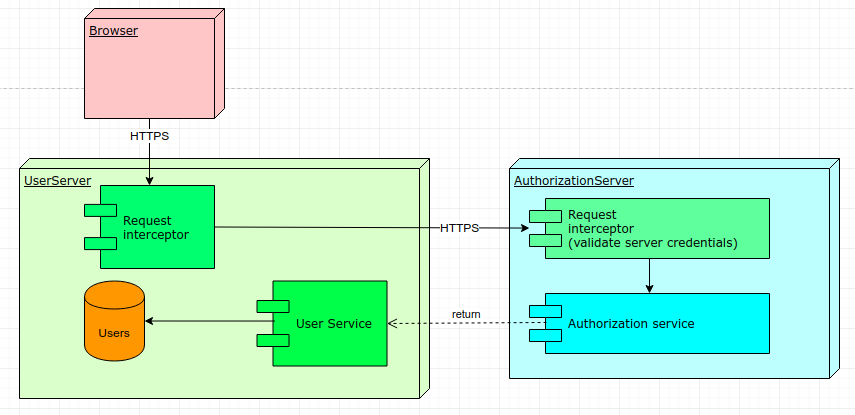

# Aplicación distribuida segura en todos sus frentes

## Descripcion

 Este proyecto tiene como fin presentar un arquitectura segura por medio del uso de 
 certificados SSL para usar protocolos de comunicacion seguros como HTTPS.
 
 Se establece la conexion segura con este servicio que solo recive peticiones HTTPS por el puerto 8443.
 
 La peticion se valida con un interceptor que determian la autorización y autenticación con ayuda de un servidor externo,
 la conexion entre este servidor y el de autentifiacion tambien esta protegida y va sobre HTTPS, además se usa un `api-key` para identificar que es este servidor el que solicita la validación de algún usuario, de no coinsidir la clave se rechazará la peticion.
 
 
 
 [Repositorio Autorización](https://github.com/SergioRt1/Secure-Architecture-Authorization)
 
### Prerequisites

 You need to have installed Java at least 1.8 and Apache Maven.

 Installing Java JDK:
```
sudo apt update
sudo apt install openjdk-8-jdk
```

### Installing
 Download the repositories.
```
git clone https://github.com/SergioRt1/Secure-Architecture.git

git clone https://github.com/SergioRt1/Secure-Architecture-Authorization.git
```
 

#### Capa de seguridad y roles
  
  Se requiere un header `api-key` para hacer un request al servidor, este se usa como identificador de cada usaurio, 
  cada `api-key` tiene un nivel de autorizacion definido por el servicio de autorizacion, el cual pude corresponder al role admin o usuario.
   
  Admin: tiene permitido hacer peticiones POST (modificar contenido)
   
      (POST) /api/users
   
   ```
   curl -X POST \
       https://localhost:8443/api/users \
       -H 'Content-Type: application/json' \
       -H 'api-key: admin' \
       -d '{
      	"name":"sergio",
      	"email":"email@mail.com"
      }
  ```
    
   api-keys: admin
    
   User: tiene permitido hacer peticiones GET (consultas)
    
       (GET) /api/users         (getAll)
       (GET) /api/users/{name}  (getByName)
          
  ```
          curl -X GET \
            https://localhost:8443/api/users/sergio \
            -H 'Content-Type: application/json' \
            -H 'api-key: user1' \
  ```
   
   api-keys: user1, user2
      
### Built with

 * [Java](https://www.java.com) - programming language
 * [Git](https://git-scm.com) - distributed version-control system for tracking changes in source code
 * [Gradle](https://gradle.org) - project management and build automation tool
 * [Spring boot](https://spring.io/projects/spring-boot) - Framework for creating web applications

## Author

 * **[Sergio Rodríguez](https://github.com/SergioRt1)**
 
## License

This project is licensed under the Apache-2.0 License - see the [LICENSE](LICENSE) file for details